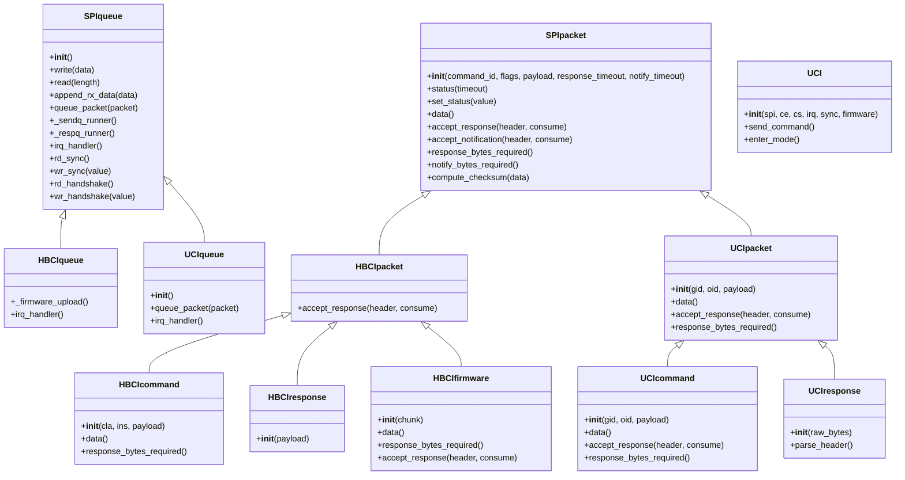

```mermaid
classDiagram

class SPIqueue {
  +__init__()
  +write(data)
  +read(length)
  +append_rx_data(data)
  +queue_packet(packet)
  +_sendq_runner()
  +_respq_runner()
  +irq_handler()
  +rd_sync()
  +wr_sync(value)
  +rd_handshake()
  +wr_handshake(value)
}

class HBCIqueue {
  +_firmware_upload()
  +irq_handler()
}

class UCIqueue {
  +__init__()
  +queue_packet(packet)
  +irq_handler()
}

class SPIpacket {
  +__init__(command_id, flags, payload, response_timeout, notify_timeout)
  +status(timeout)
  +set_status(value)
  +data()
  +accept_response(header, consume)
  +accept_notification(header, consume)
  +response_bytes_required()
  +notify_bytes_required()
  +compute_checksum(data)
}

class HBCIpacket {
  +accept_response(header, consume)
}

class HBCIcommand {
  +__init__(cla, ins, payload)
  +data()
  +response_bytes_required()
}

class HBCIresponse {
  +__init__(payload)
}

class HBCIfirmware {
  +__init__(chunk)
  +data()
  +response_bytes_required()
  +accept_response(header, consume)
}

class UCIpacket {
  +__init__(gid, oid, payload)
  +data()
  +accept_response(header, consume)
  +response_bytes_required()
}

class UCIcommand {
  +__init__(gid, oid, payload)
  +data()
  +accept_response(header, consume)
  +response_bytes_required()
}

class UCIresponse {
  +__init__(raw_bytes)
  +parse_header()
}

class UCI {
  +__init__(spi, ce, cs, irq, sync, firmware)
  +send_command()
  +enter_mode()
}

SPIqueue <|-- HBCIqueue
SPIqueue <|-- UCIqueue
SPIpacket <|-- HBCIpacket
SPIpacket <|-- UCIpacket
HBCIpacket <|-- HBCIcommand
HBCIpacket <|-- HBCIresponse
HBCIpacket <|-- HBCIfirmware
UCIpacket <|-- UCIcommand
UCIpacket <|-- UCIresponse
```

