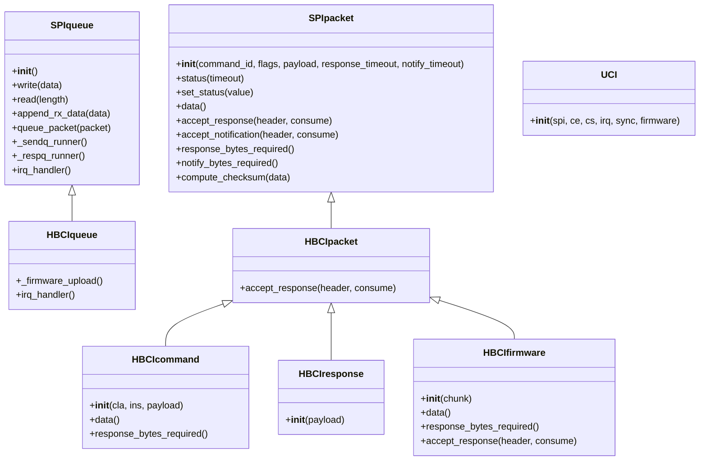

```mermaid
classDiagram

class SPIqueue {
    +__init__()
    +write(data)
    +read(length)
    +append_rx_data(data)
    +queue_packet(packet)
    +_sendq_runner()
    +_respq_runner()
    +irq_handler()
}

class HBCIqueue {
    +_firmware_upload()
    +irq_handler()
}

class SPIpacket {
    +__init__(command_id, flags, payload, response_timeout, notify_timeout)
    +status(timeout)
    +set_status(value)
    +data()
    +accept_response(header, consume)
    +accept_notification(header, consume)
    +response_bytes_required()
    +notify_bytes_required()
    +compute_checksum(data)
}

class HBCIpacket {
    +accept_response(header, consume)
}

class HBCIcommand {
    +__init__(cla, ins, payload)
    +data()
    +response_bytes_required()
}

class HBCIresponse {
    +__init__(payload)
}

class HBCIfirmware {
    +__init__(chunk)
    +data()
    +response_bytes_required()
    +accept_response(header, consume)
}

class UCI {
    +__init__(spi, ce, cs, irq, sync, firmware)
}

SPIqueue <|-- HBCIqueue
SPIpacket <|-- HBCIpacket
HBCIpacket <|-- HBCIcommand
HBCIpacket <|-- HBCIresponse
HBCIpacket <|-- HBCIfirmware
```

